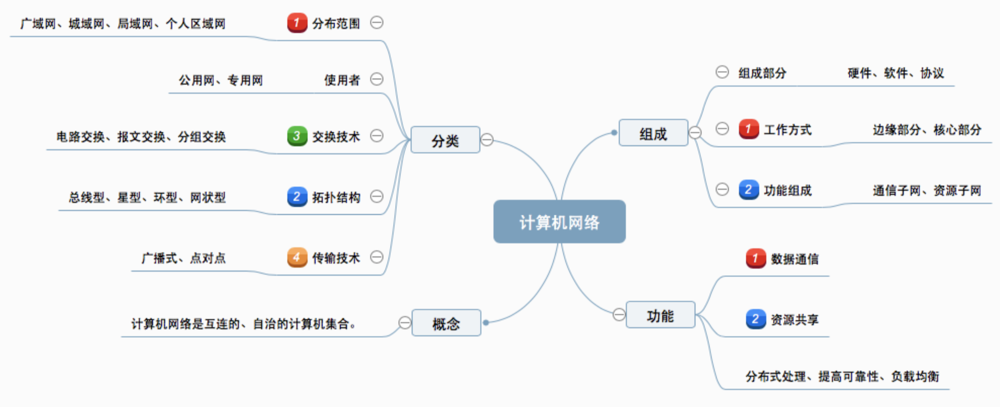

> ### 计算机网络的概念

- 计算机网络：是一个将分散的/具有独立功能的**计算机系统**，通过**通信设备**和**线路**连接起来的，由功能完善的**软件**实现**资源共享**和**信息传递**的系统。

- 计算机网络是**互连**的/**自治**的计算机集合。

 

> ### 计算机网络的功能

- **数据通信**(连通性):微信/qq

- **资源共享**:硬件-打印机/软件/数据-百度文库

- **分布式处理**:多台计算机各自承担同一工作任务的不同部分-Hadoop

- **提高可靠性**:宕机-替代机

- **负载均衡**:各计算机更亲密

 

> ### 计算机网络的组成

- **组成部分**：硬件/软件/协议
- **工作方式**
  - 边缘部分：用户直接使用
    - C/S方式
    - P2P方式
  - 核心部分：为边缘部分服务
- **功能组成**：数据通信/资源共享
  - 通信子网：实现**数据通信**
    - 应用层
    - 表示层
    - 会话层
  - 资源子网：实现**资源共享**
    - 传输层（上下子网的接口）
    - 网络层：路由器
    - 数据链路层：交换机/网桥
    - 物理层：集线器/中继器

 

> ### 计算机网络的分类

- 按分布范围
  - 广域网WAN
  - 城域网MAN
  - 局域网LAN
  - 个人区域网PAN
- 按使用者
  - 公用网 电信
  - 专用网 军队 
- 按交换技术
  - 电路交换
  - 报文交换
  - 分组交换
- 按拓扑结构
  - 总线型
  - 星型 有一个中心节点
  - 环型
  - 网状型 广域网
- 按传输技术
  - 广播式网络：共享公共通信信道
  - 点对点网络：使用**分组存储转发**和**路由选择**机制

