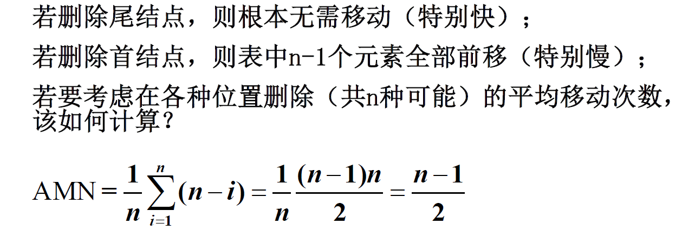

> ### 线性表的逻辑结构

**线性表**是具有相同数据类型的n个数据元素的**有限序列**。

- 第一个元素成为表头元素；最后一个元素称为表尾元素。
- 除了第一个元素以外，每个元素**有且只有一个直接前驱**。
- 除了最后一个元素以外，每个元素**有且只有一个直接后继**。

<br>

> ### 线性表的顺序存储

定义：是一组**地址连续**的存储单元(比如C的数组)，依次存储线性表中的数据元素。

- 顺序存储的线性表也叫顺序表。
- Loc(ai)=Loc(a1)+(i-1)*d 查找每一个元素位置 时间复杂度O(1)

<br>

> ### 静态链表

顺序表三部分：

- 存储空间的起始位置
- 顺序表最大存储容量
- 顺序表当前的长度

```c++
#define MaxSize 50 //定义线性表最大长度
typedef int Elemtype //表中元素类型是int
typedef struct
{
  ElemType data[MaxSize]; //顺序表的元素
  int length; // 顺序表当前的长度
}SqList; //顺序表的类型定义
```

<br>

<br>

存储空间也可以动态分配，也就是存储数组的空间是在**程序执行过程中**通过动态分配语句来分配。

```c++
typedef int Elemtype
typedef struct
{
  Elemtype *data;  //动态分配数组的指针
  int MaxSize,length; //数组的最大容量和当前个数
}SqList;


//动态分配语句
#define InitSize 100
SqList L;
L.data = (Elemtype*)malloc(sizeof(Elemtype)*InitSize);
```

<br>

> ### 顺序存储的相关操作

- 插入
  - 判断i的值是否正确
  
  - 判断表长是否超过数组长度
  
  - 从后向前到第i个位置，分别将这些元素都向后移动一位
  
  - 将该元素插入位置i并修改表长
  
  - ```c++
  bool ListInsert(SqList &L, int i, Elemtype e)
  {
    	if(i < 1||i>L.length+1) //判断i的范围是否有效
    		return false;
    	if(L.length>=MaxSize) //当前存储空间已满/不能插入
    		return false;
    	for(int j = L.length;j >= i;j--) //将第i个元素及之后的元素后移
    		L.data[j] = L.data[j-1];
    	L.data[i-1] = e; //在位置i处放入e
    	L.length++;
  }
    ```
    
  - 
  
  - 平均时间复杂度为O(n)
  
- 删除

  - 算法流程：删除顺序表L中第i（i<i<L.length）个位置的元素，成功则返回true，并将被删除的元素用引用变量e返回，否则返回false。

  - 判断i的值是否真确

  - 取删除的元素

  - 将被删除元素后面的所有元素都一次向前移动一位

  - ```c++
    bool ListDelete(SqList &L, int i,Elemtype &e)
    {
        if(i<1||i>L.length)
            return false;
        e = L.data[i-1];
        for(int j=i;j<L.length; j++)
            L.data[j-1] = L.data[j];
    }
    ```

  - 

> ### 顺序表优缺点

- 优点
  - 存储密度大：不需要为表中元素之间的逻辑关系增加额外存储空间。
  - 随机存取：可以快速存取表中任一位置的元素
- 缺点
  - 插入和删除操作需要移动大量元素
  - 对存储空间要求高，会产生存储空间的碎片

