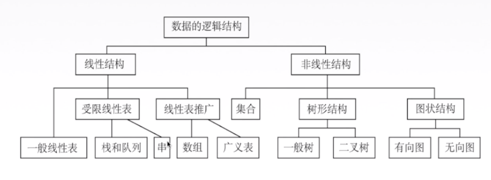

> ###基本概念

- **数据**：数据是信息的载体，是描述客观事物属性的数字/字符以及能够输入到计算机中并被计算机程序识别和处理的符号的集合。
- **数据元素**：是数据的**基本单位**，通常作为一个整体进行考虑和处理。一个数据元素可由若干个数据项组成，数据项是构成数据元素的**不可分割的最小单位**。例如，学生记录就是一个数据元素，它由学号/姓名等数据项组成。
- **数据类型**：数据类型是一个值的集合和定义在此集合上一组操作的总称。
  - 原子类型：不可再分的数据类型。
  - 结构类型：可以再分解为若干成分的数据类型。
  - 抽象数据类型：抽象数据组织和与之相关的操作。
- **抽象数据类型**：ADT是一个**数学模型**以及定义在模型上的一组操作。抽象数据类型的定义仅取决于它的一组逻辑特性，而与其在计算机内部如何表示和实现无关。通常用**数据对象/数据关系/基本操作集**这样的三元组来表示抽象数据类型。
- **数据结构**：是相互之间存在一种或者多种特定关系的数据元素的集合。包括三个方面：**逻辑结构/存储结构/数据的运算**。一个算法的设计取决于所选定的逻辑结构。而算法的实现依赖于所采用的储存结构。

> ### 逻辑结构

**逻辑结构**：数据元素之间的逻辑关系，从逻辑关系描述数据，与数据的存储无关，是独立于计算机的。

分类：**线性结构**和**非线性结构**

